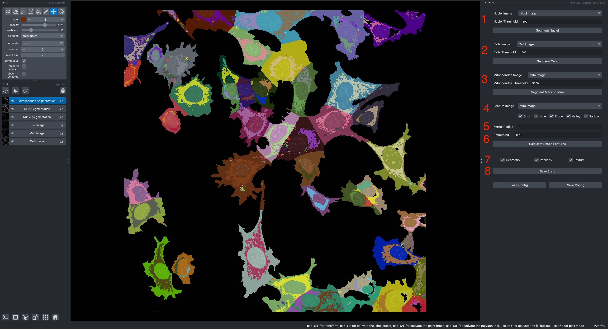

Napari MitoHCS
==============

Napari MitoHCS is a plugin for `napari <https://napari.org/stable/>`_ that helps analyze high-content images of mitochondira.
It allows you to segment nuclei, cells, mitochondira, and then extract texture features of the mitochondria that can be useful when comparing the state of different cell types.

Interactive Processing
----------------------

``napari-mito-hcs`` can be accessed from the plugin menu under ``Plugins > Mito HCS (napari-mito-hcs)``.
Sample data can be loaded from ``Open Sample > napari_mito_hcs > Mito HCS Example (WT)``.

1. Load a nuclei image.
   In the sample data, this is called ``Nucl Image``.
   Select a threshold to segment the nuclei, then click ``Segment Nuclei``.
2. Load a cytoplasm/cell mask stained image. In the sample data, this is called ``Cell Image``.
   Select a threshold to segment the cells, then click ``Segment Cells``.
   The cell segmentation algorithm will try to use the nuclei segmentation to split touching cells.
3. Load an image stained for mitochondria.
   In the sample data, this is called ``Mito Image``.
   Select a threshold to segment the mitochondria, then click ``Segment Mitochondria``.
   The mitochondria segmentation algorithm will try to assign mitochondria to individual cells from the cell segmentation.
4. Select which shape index-based texture features to calculate from the mitochondria intensity image.
   At least ``Spot`` and ``Ridge`` must be selected if you want to calculate the spot to ridge ratio feature used by ``Mito HCS``.
   Other features may also be useful for different mitochondrial phenotypes.
5. Set ``kernel radius > 0`` if you need to subtract a background signal from your mitochondria image before extracting features.
6. Set the smoothing parameter for the image (values between ``0.5`` and ``1.0`` tend to work well).
   Once you're ready click ``Calculate Shape Features``.
7. Finally, choose which statistics to save:
   ``Geometry`` calculates morphological measurements of mitochondria.
   ``Intensity`` calculates average intensity of other stains within the mitochondria.
   ``Texture`` calculates average values for the shape index-based texture features.
   ``Geometry`` and ``Texture`` must be selected to calculate the final spot to ridge ratio feature used by ``Mito HCS``.
   Other statistics may also be useful for different mitochondrial phenotypes.
8. Click ``Save Stats`` to save per-mitochondria measurements to an Excel spreadsheet.

Test out the segmentation pipeline on a few images from your data set
(for instance, try the same parameters on ``Open Sample > napari_mito_hcs > Mito HCS Example (KO)``).
Once you're happy with how the pipeline performs on several images, select ``Save Config`` to write the parameters out to a TOML configuration file that can be used for batch processing.

If you have parameters saved from a previous session, you can reload them using ``Load Config``.

Batch Processing
----------------

Once you have the parameters for your segmentation pipeline, you can use them to segment an entire directory of images with the ``mito-hcs-batch.py`` script in the ``scripts/`` folder.
Given a folder of images located at ``path/to/images`` and a config file at ``path/to/config.toml``, you can run the script with:

.. code-block:: bash

   mito-hcs-batch --config-file path/to/config.toml path/to/data

Results will be writen to the folder ``path/to/images/mito-hcs``.

Segment a directory and write the outputs to a different location:

.. code-block:: bash

   mito-hcs-batch -o path/to/output path/to/images

Results will be writen to the folder ``path/to/output``.

Run the command ``mito-hcs-batch --help`` to see additional options.

Configuration File
------------------

The configuration file is written in the `TOML file format <https://toml.io/en/>`_.

The default configuration for `napari-mito-hcs` looks like this:

.. literalinclude:: ../src/napari_mito_hcs/config/mito-hcs.toml
   :language: toml

It defines several sections which control how the batch processing finds, segments, and analyzes images.

find_file_params
^^^^^^^^^^^^^^^^

This section defines three `regular expressions <https://docs.python.org/3/library/re.html>`_ that are used to find the cell, nuclei, and mitochondria images respectively.
The regular expression must define a group (a pattern between parenthesis ``($prefix)``) that captures a prefix suitable for organizing the images into individual fields of view.
The pattern is case-insensitive and should not include the ".tif" suffix.

Ex: The default ``cell_pattern`` is ``(r[0-9]+c[0-9]+f[0-9]+)ch1`` which matches an image with a name like ``r02c03f01ch1.tif`` and will group it with other images with the prefix ``r02c03f01``

seg\_\*\_params
^^^^^^^^^^^^^^^

All the segmentation pipelines define the same set of parameters:

* ``intensity_smoothing`` - Smooth the image with a gaussian filter with this width (default: ``0.5``, set to ``0.0`` to skip smoothing)
* ``threshold`` - Values greater than or equal to this threshold are foreground objects to be segmented (default: ``500``)
* ``largest_hole`` - Fill holes (``mask == 0``) in the mask if they are this size (in square px) or smaller (default: ``1000`` set to ``0`` to skip hole filling)
* ``smallest_object`` - Remove objects (``mask == 1``) in the mask if they are this  size (in square px) or smaller (default: ``200`` set to ``0`` to skip object removal)
* ``binary_smoothing`` - Perform a binary dilation and then a binary erosion (binary closing) of this many pixels (default: ``2`` set to ``0`` to skip smoothing)
* ``algorithm`` - One of ``nuclei``, ``cell``, or ``mitochondria`` - which algorithm should be used to split touching objects in the mask

The segmentation algorthms first split non-contiguous regions using ``scipy.ndimage.label``, then they each use a different strategy to split regions that touch:

* ``nuclei`` - Perform a watershed transform and split labels by watershed basin (works well for separating touching circles)
* ``cell`` - Use the nuclei segmentation to split cytoplasm segments by assigning each pixel to the nearest nuclei
* ``mitochondria`` - Use the cell segmentation to split mitochondria segments by assigning them to the closest cell

In the standard pipeline, first the nuclei segmentation, then the cell segmentation, and finally the mitochondira segmentation is run.

shape_index_params
^^^^^^^^^^^^^^^^^^

This section defines which shape index features should be extracted per-image.

* ``features`` - The list of features to extract. At least ``spot`` and ``ridge`` need to be present to calculate the ``SI Ratio`` feature
* ``intensity_smoothing`` - Smooth the intensity image with a gaussian filter with this width (default: ``0.75``, set to ``0.0`` to skip smoothing)
* ``parabola_height`` - Remove the background with a rolling parabola filter with this height (default: ``0``, set to ``0`` to skip background subtraction)

Available features are ``spot``, ``hole``, ``ridge``, ``valley`` and ``saddle``. Equivalents for ``dark``, ``bright``, and ``edge`` are not implemented.

stat_params
^^^^^^^^^^^

This section defines which statistics are calculated per-cell and the pixel pitch for images

* ``stats`` - which stats to extract. At least ``geometry`` and ``texture`` need to be selected to calculate the ``SI Ratio`` feature
* ``spacing`` - ``[width, height]`` of a single pixel in the image in um/px (Ex: ``[0.5, 0.5]`` for an image with ``0.5 um/px`` square pixels)

Available stats are:

* ``geometry`` - area, perimeter, position, and aspect ratio of a cell or mitochondira cluster
* ``intensity`` - mean intensity of the cell, nuclei, and mitochondria image within each cell
* ``texture`` - mean values for each texture feature specified in the ``shape_index_params`` section

Stats are written per-field of view to the output folder ``path/to/images/mito-hcs`` and a collated summary is written to ``path/to/images/mito-hcs/mito-hcs-stats.xlsx``

API Documentation
-----------------

.. toctree::
   :maxdepth: 2

   pipeline
   segmentation
   feature
   stats
   widget
   config
   finder
   utils

Indices and tables
==================

* :ref:`genindex`
* :ref:`modindex`
* :ref:`search`
